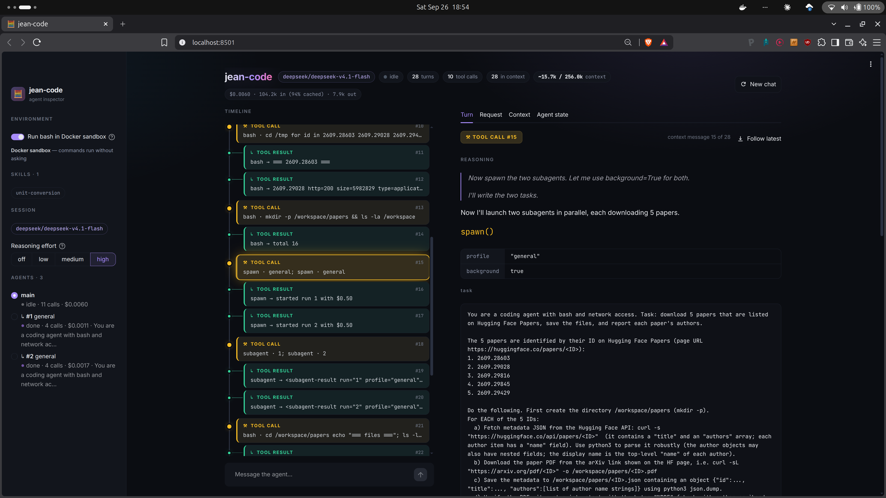

# Jean-Code - A minimal Coding Harness for Educational Purposes.

A small coding agent that works in your shell and in your browser. Built on [OpenRouter](https://openrouter.ai) (DeepSeek V4.1 Flash by default) - Supports all the goodies you're used to in agents: bash, tools, web-browsing, subagents, etc.



## Running it

You need [uv](https://docs.astral.sh/uv/). Docker is optional, but the sandbox and the `general` subagent need it
(see [Where commands run](#where-commands-run)).

**1. Add your OpenRouter key.** Create a key at <https://openrouter.ai/keys>, then put it in a `.env` file at the
repo root (it is gitignored):

```sh
echo 'OPENROUTER_API_KEY=sk-or-v1-...' > .env
```

The key needs credits on your OpenRouter account. With the default model, sessions are cheap: the one in the
screenshot above (11 model calls, 104k input tokens) cost $0.006.

**2. (Optional) Build the sandbox image.** Skip this if you don't have Docker.

```sh
docker build -t jean-code-sandbox sandbox/
# if your user id isn't 1000:
docker build --build-arg UID=$(id -u) --build-arg GID=$(id -g) -t jean-code-sandbox sandbox/
```

The sandbox mounts the repo's `workspace/` folder into the container (and nothing else). Docker Desktop can only
mount folders under your home directory by default, so if the repo is cloned elsewhere (e.g. `/tmp`), the sandbox
fails with "Mounts denied": clone it under your home, or add its location under Settings → Resources → File sharing.

**3. Start a front-end.** `uv run` installs the dependencies on first use.

```sh
# Streamlit UI, at http://localhost:8501
uv run --env-file .env streamlit run src/app.py

# Terminal REPL
uv run --env-file .env python src/repl.py
```

In the UI, the sidebar has the sandbox switch ("Run bash in Docker sandbox", which starts a new chat) and the
reasoning effort. Type `/compact` in the chat to summarize older turns now.

REPL options: `--sandbox` runs commands in Docker, `--no-network` cuts the container off from the network,
`--model` takes any OpenRouter model id, `--reasoning low|medium|high`, `--max-cost` stops the session at a USD
limit, and `--compact-at` sets the token count that triggers compaction. Type `/cost` to see what the session has
spent, and `exit` to quit.

### Where commands run

- **On your machine (the default):** commands run in the directory you started the front-end from, and each one
  waits for your approval. Started from the repo root, the agent works on jean-code itself. To point it at another
  project, start it from there:

  ```sh
  cd ~/my-project
  uv run --project ~/jean-code --env-file ~/jean-code/.env python ~/jean-code/src/repl.py
  ```

- **In the sandbox (`--sandbox`, or the UI switch):** commands run in a container, in `/workspace`, which is the
  repo's `workspace/` folder. They don't ask for approval, and they can't see the rest of your machine.

The `general` subagent always runs in its own sandbox container, even when the main agent runs on your machine, so
without Docker and the image it fails, and only the `searcher` subagent works.

## Key features

- **Runs commands for you**, on your machine with your approval, or in a Docker sandbox without asking.
- **Searches the web** and reads pages when it needs documentation or answers.
- **Delegates to subagents**: a web researcher, and a coding agent that experiments in the sandbox while the main
  one keeps working.
- **Skills**: teach it a task with a folder in `skills/`: a `SKILL.md` (YAML front matter with a `name` and a
  `description`, then the instructions) plus any reference files. See `skills/unit-conversion/` for an example.
- **Long sessions**: when the conversation gets too long, it summarizes the older turns and carries on.
- **Cost control**: shows what each session costs, and stops at a spending limit you set. Every model call is also
  logged to `logs/usage.jsonl`.
- **See what it's doing**: the UI shows every thought, tool call and result live, for the main agent and each subagent.

## Layout

```
src/
  agent.py      the agent loop: tool calls, approvals, compaction
  coding.py     the coding agent and its subagent profiles
  prompts.py    system prompts and the compaction prompt
  shell.py      host and Docker shell backends
  subagents.py  starting, waiting for and managing subagent runs
  skills.py     skill discovery
  tools.py      web tools
  llm.py        OpenRouter client, and tool schemas built from functions
  usage.py      cost records, logging and budgets
  config.py     paths in the repo
  repl.py       terminal front-end
  app.py        Streamlit front-end (app.css holds its styles)
skills/         skill folders
sandbox/        Dockerfile for the sandbox
tests/          unit tests, with a scripted fake model: no API key needed
docs/           the README's screenshot

Created at runtime (gitignored):
workspace/      the sandbox's /workspace
logs/           usage.jsonl, one line per model call
```

Run the tests with `uv run pytest`.
